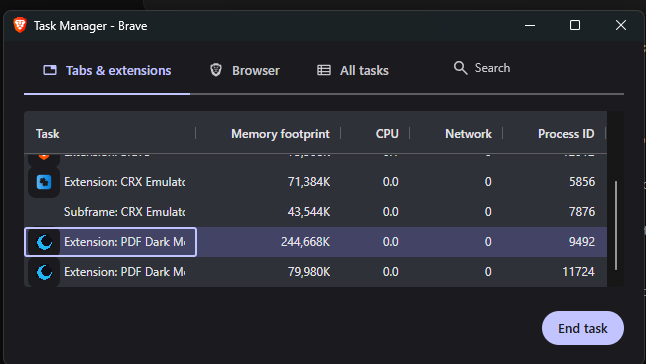

# PDF Dark Mode Reader (v2.1.0)

This is a browser extension for Chrome, Brave, and Edge. It lets you read PDF documents in dark mode. 

The extension uses viewport virtualization and CSS themes on the GPU. It can load documents with more than 250 pages. The extension uses less than 100 MB of memory. It keeps CPU usage low.

  

## Performance 

The version 2.0.0 update changed the rendering process. The extension now uses virtualized pages, lazy-loaded thumbnails, and CSS themes.

| Metric | Version 1 | Version 2.0.0 | Result |
| :--- | :--- | :--- | :--- |
| **Dark Mode Processing** | 200 to 800 ms per page | 0 ms | Faster |
| **Pages in Memory (250 pages)** | 250 pages | Maximum 10 pages | Less memory |
| **System Memory Usage** | 2.1 GB | 80 to 100 MB | Less memory |
| **Theme Change** | Slow | Instant | Faster |
| **Thumbnail Rendering** | Slows down the user interface | Lazy-loaded | Better scrolling |

  

## Features

- **Viewport Virtualization:** The extension only renders the pages in the viewport and a small buffer. The extension removes pages from memory when you scroll past them.
- **GPU-Accelerated CSS Dark Mode:** The extension uses CSS filters to change themes instantly.
- **Table of Contents:** You can use the outline sidebar to navigate the chapters of the document.
- **Tabbed Sidebar:** You can switch between the thumbnails view and the outline view.
- **Six Themes:** You can select Classic Dark, Warm, Blue, Green, Sepia, or High Contrast.
- **Lazy-Loaded Thumbnails:** The extension loads the sidebar thumbnails only when they are visible. 
- **Asynchronous Search:** The extension finds text in the background. It highlights active matches in orange. It highlights background matches in yellow.
- **Floating Page Indicator:** A page number shows when you scroll. It disappears after 1.5 seconds.
- **Privacy:** The extension processes all files on your local computer. Your files do not go to the internet.

## Themes

1. **Classic Dark:** Dark grey background with high-contrast text.
2. **Warm:** Dark brown colors for night reading.
3. **Blue:** Dark blue colors.
4. **Green:** Dark green colors.
5. **Sepia:** Warm cream background.
6. **High Contrast:** Black background with white text.

## Keyboard Shortcuts

| Action | Shortcut |
| :--- | :--- |
| **Find Text** | `Ctrl + F` or `Cmd + F` |
| **Jump to Page** | `Ctrl + G` or `Cmd + G` |
| **Zoom In** | `Ctrl + =` or `Ctrl + +` or `Cmd + +` |
| **Zoom Out** | `Ctrl + -` or `Cmd + -` |
| **Reset Zoom** | `Ctrl + 0` or `Cmd + 0` |
| **Rotate Page (Clockwise)** | `R` |
| **Toggle Outline Sidebar** | `Ctrl + Shift + O` or `Cmd + Shift + O` |
| **Next Page** | `PageDown` |
| **Previous Page** | `PageUp` |
| **Go to First Page** | `Home` |
| **Go to Last Page** | `End` |
| **Close Sidebar** | `Escape` |

## Technical Architecture

The extension has six main parts:

- **`app.js`**: Loads the PDF document and manages the other parts.
- **`RenderEngine.js`**: Manages the page queues, viewport calculations, and text extraction.
- **`DarkModeProcessor.js`**: Applies the CSS filters for the themes.
- **`ThumbnailManager.js`**: Manages the lazy-loading of the sidebar previews.
- **`OutlineManager.js`**: Manages the document table of contents.
- **`UIController.js`**: Manages the search highlights, keyboard shortcuts, and scrolling.

## Installation

Do these steps to install the extension manually:

1. Click the **Code** button at the top of this repository.
2. Select **Download ZIP**.
3. Extract the ZIP file to a folder on your computer.
4. Open your browser.
5. Go to `chrome://extensions/`.
6. Turn on **Developer mode** in the top right corner.
7. Click the **Load unpacked** button.
8. Select the folder that has the `manifest.json` file.

## License

This project uses the MIT License.
