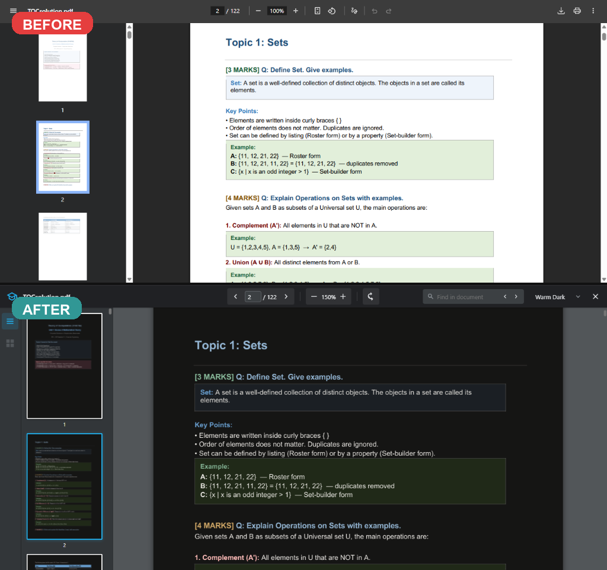

# 🌙 PDF Dark Mode Reader (v2.0.0)

A powerful, fast, and completely customizable PDF reader extension for Chrome, Brave, and Edge that brings true dark mode to your documents.

Featuring a **viewport-virtualized rendering engine** and a **GPU-accelerated theme system**, it can load 250+ page documents seamlessly while keeping memory footprint extremely low (under 100MB) and CPU usage at a minimum.

  

---

## ⚡ Performance Breakdown (v1.x vs v2.0.0)

With the v2.0.0 overhaul, the rendering pipeline has been rewritten to support virtualized pages, low-overhead thumbnails, and instant theme swaps:

| Metric | v1.x (Before) | v2.0.0 (After) | Improvement |
| :--- | :--- | :--- | :--- |
| **Dark Mode Processing** | ~200–800ms / page (Pixel loop) | ~0ms (GPU CSS Filters) | **99%+ Faster** |
| **Active Pages in Memory (250pg PDF)** | 250 (All rendered) | ≤ 10 (Visible viewport range) | **96% Reduction** |
| **System Memory Usage (250pg PDF)** | ~2.1 GB (Linear bloat) | ~80–100 MB (Constant plateau) | **95% Less Memory** |
| **Theme Switching** | Full document re-render | CSS property swap | **Instant** |
| **Thumbnail Rendering** | 50+ Sync renders blocking UI | Lazy-loaded on-demand | **Smooth scrolling** |
| **Thumbnail Image Resolution** | Scale `0.4` | Scale `0.2` | **75% fewer pixels** |
| **Scroll Experience** | Direct listener (heavy lag) | RequestAnimationFrame debounced | **Smooth 60fps scrolling** |

---

## ✨ Key Features

- **Viewport Virtualization:** Only renders pages currently visible in the viewport plus a small buffer ($\pm2$ pages). Pages scrolled out of bounds are automatically unloaded from memory to prevent bloat.
- **GPU-Accelerated CSS Dark Mode:** Swaps themes instantly using CSS filter matrices applied on the GPU, eliminating the render latency of pixel-by-pixel loops.
- **6 Viewing Themes:** Customize your reading comfort with Classic Dark, Warm (Sepia-like), Blue, Green, Sepia, and High Contrast.
- **Lazy-Loaded Thumbnails:** Sidebar thumbnails are observed via `IntersectionObserver` and loaded on-demand at a lower scale (`0.2`) to protect performance.
- **Asynchronous Search:** Scans and extracts text in the background without freezing the UI, highlighting active matches in orange and background matches in yellow.
- **Floating Page Indicator:** A modern glassmorphic page overlay pill that pops up during scroll navigation and fades out elegantly after 1.5 seconds.
- **Privacy First:** Fully client-side. Your PDFs never leave your machine; all rendering and text extraction occurs locally.

---

## 🎨 Themes Included

1. **Classic Dark:** True dark grey background with high-contrast text.
2. **Warm:** Soft dark brown tones, ideal for late-night reading.
3. **Blue:** Sleek dark blue tint (Nord-like style).
4. **Green:** Forest green dark mode, easy on the eyes.
5. **Sepia:** Classic warm cream paper background (light mode helper).
6. **High Contrast:** Pure black background with stark white text and highly saturated colors.

---

## ⌨️ Keyboard Shortcuts

Take full control of your reading experience with built-in shortcuts:

| Action | Shortcut |
| :--- | :--- |
| **Find Text** | `Ctrl + F` / `Cmd + F` |
| **Jump to Page** | `Ctrl + G` / `Cmd + G` |
| **Zoom In** | `Ctrl + =` / `Ctrl + +` / `Cmd + +` |
| **Zoom Out** | `Ctrl + -` / `Cmd + -` |
| **Reset Zoom** | `Ctrl + 0` / `Cmd + 0` |
| **Rotate Page (Clockwise)** | `R` |
| **Next Page** | `PageDown` / `ArrowRight` (in page input) |
| **Previous Page** | `PageUp` / `ArrowLeft` (in page input) |
| **Go to First Page** | `Home` |
| **Go to Last Page** | `End` |
| **Close Sidebar/Search** | `Escape` |

---

## 🏗️ Technical Architecture

The extension is organized as an orchestrator managing four decoupled sub-systems:

- **`app.js`**: Core orchestrator handling PDF document loading, lifecycle events, and subsystem wiring.
- **`RenderEngine.js`**: Manages page rendering queues, viewport virtualization calculations, page canvas allocations/deallocations, and text extraction.
- **`DarkModeProcessor.js`**: Configures GPU CSS filter overrides, custom themes, and optimized fallback pixel canvas processors.
- **`ThumbnailManager.js`**: Controls lazy-loading of sidebar previews, scale overrides, and delegated event handling.
- **`UIController.js`**: Hooks up search highlight bindings, shortcut event keymaps, scroll synchronization, and floating HUD overlays.

---

## 🛠️ Installation (Developer Mode)

Since this extension is loaded locally for developers:

1. **Download the Extension:**
   - Click the green **Code** button at the top of this repository and select **Download ZIP**.
   - Extract the downloaded ZIP file to a folder on your computer.

2. **Open Extensions Page:**
   - In Chrome, Brave, or Edge, navigate to `chrome://extensions/`.

3. **Enable Developer Mode:**
   - Toggle **Developer mode** in the top right corner.

4. **Load the Extension:**
   - Click the **Load unpacked** button in the top left.
   - Select the folder containing `manifest.json`.

---

## 📄 License

This project is open-source under the MIT License. Feel free to modify, extend, and share!
